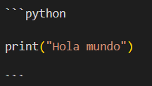
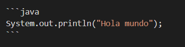

# 📘 Introducción a Markdown

**Markdown** es un lenguaje de marcado ligero que permite dar formato a un texto de manera sencilla.
GitHub convierte automáticamente los archivos `.md` a **HTML**, por lo que es muy útil para escribir documentación, tutoriales o páginas web con **GitHub Pages**.

A continuación verás ejemplos con el **código Markdown** y el **resultado renderizado**.

---

## 1. Títulos

En Markdown los títulos se crean con almohadillas `#`.
Cuantas más almohadillas, menor el nivel del título.

```md
# Título 1
## Título 2
### Título 3
```

**Resultado:**

# Título 1

## Título 2

### Título 3

---

## 2. Énfasis (negrita y cursiva)

Se usan asteriscos o guiones bajos:

```md
*texto en cursiva*  
**texto en negrita**  
*** negrita y  cursiva ***
```

**Resultado:**

*texto en cursiva*

**texto en negrita**

***negrita y cursiva***

---

## 3. Listas

### Viñetas

```md
- Elemento 1
- Elemento 2
  - Sub-elemento
```

**Resultado:**

* Elemento 1
* Elemento 2

  * Sub-elemento

### Numeradas

```md
1. Primer paso
2. Segundo paso
3. Tercer paso
```

**Resultado:**

1. Primer paso
2. Segundo paso
3. Tercer paso

---

## 4. Enlaces e Imágenes

```md
[Visitar GitHub](https://github.com)  


```

**Resultado:**

[Visitar GitHub](https://github.com)


---

## 5. Código

Para resaltar código en línea se usan comillas invertidas (`):

```md
El comando `git status` muestra el estado del repositorio.
```

**Resultado:**

El comando `git status` muestra el estado del repositorio.

Para bloques de código se usan tres comillas invertidas (```):



**Resultado:**

```python
print("Hola mundo")
```
Se puede incluir el lenguaje y cambiará la presentación del código:



```java
System.out.println("Hola mundo");
```

---

## 6. Citas

```md
> Esto es una cita en Markdown.
```

**Resultado:**

> Esto es una cita en Markdown.

---

## 7. Separadores

El siguiente código:

```md
---
```

Genera la línea horizontal:

---

> sito web para practicar:
> [live preview](https://markdownlivepreview.com/)