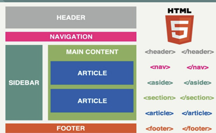
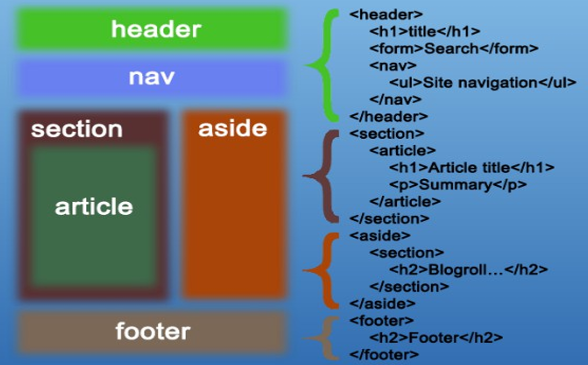

# Etiquetas semánticas

Elegid la etiqueta por el significado del contenido. `header` introduce, `nav` agrupa navegación, `main` contiene lo principal y `footer` cierra un documento o sección. `section` agrupa un tema; `article` representa contenido autónomo; `aside` aporta contenido relacionado de forma secundaria.

Estas etiquetas no colocan por sí solas barras laterales, columnas o menús horizontales. Esa distribución se trabaja con CSS.

[Abrir el ejemplo completo sin CSS](UT2_index_16semánicas.html).

Los esquemas ilustran relaciones y posibles distribuciones, no una maquetación automática ni una estructura obligatoria para todas las páginas.
