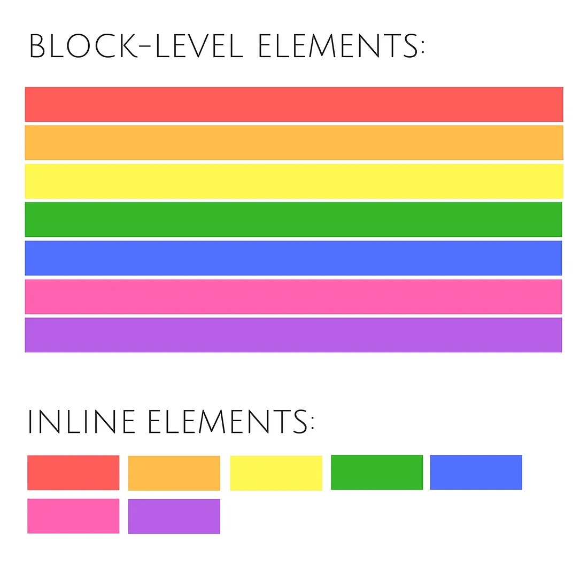
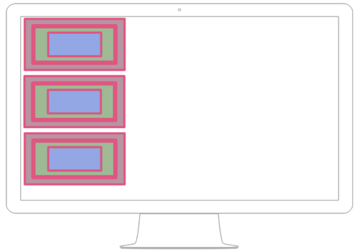
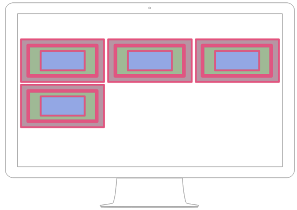
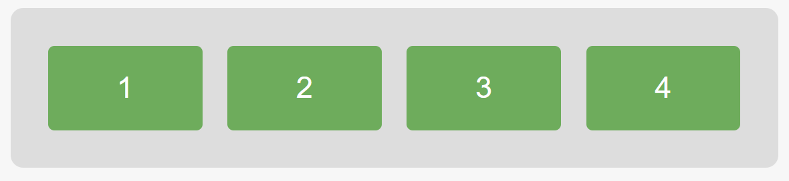
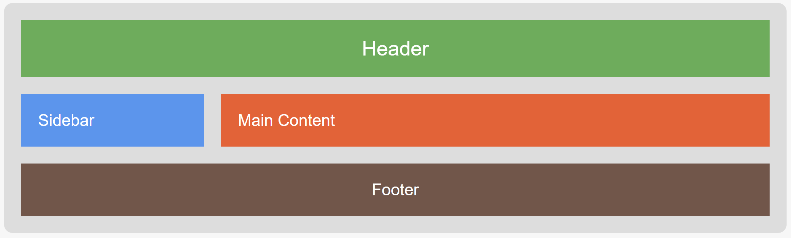
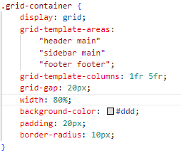

[Volver al índice](./03.md)

# LM030701 Modelo de cajas

En esta sección exploraremos el **modelo de cajas** en CSS, que es fundamental para entender cómo se distribuyen y organizan los elementos en una página web. Además, hablaremos de las propiedades principales de las cajas, la diferencia entre los elementos de **bloque** y de **línea**, y cómo usar los sistemas de diseño modernos como **Flexbox** y **Grid**.

### 1. Propiedades de las cajas

[Ejemplo: representación de las propiedades](./07%20caja/caja.html)

El modelo de cajas en CSS define cómo se estructura cada elemento en una página web. Todos los elementos HTML se consideran cajas, y están compuestos por las siguientes áreas:

- **Contenido**: La parte donde reside el contenido del elemento, como texto o imágenes.
- **Relleno (padding)**: El espacio entre el contenido y el borde de la caja.
- **Borde (border)**: El borde que rodea la caja.
- **Margen (margin)**: El espacio entre la caja y otros elementos.

#### Propiedades relacionadas con el modelo de cajas:

figura resumen:

<p><a href="https://commons.wikimedia.org/wiki/File:Boxmodell-detail.png#/media/File:Boxmodell-detail.png"></a><br>By <a href="//commons.wikimedia.org/wiki/User:G%C3%BCnther_M._Apsel" title="User:Günther M. Apsel">Matthias Apsel</a> - <span class="int-own-work" lang="en">Own work</span>, <a href="http://creativecommons.org/publicdomain/zero/1.0/deed.en" title="Creative Commons Zero, Public Domain Dedication">CC0</a>, <a href="https://commons.wikimedia.org/w/index.php?curid=34932417">Link</a></p>

- **`width`** y **`height`**: Definen el ancho y el alto del área de contenido de la caja.
- **`padding`**: Controla el espacio entre el contenido y el borde.
  
  ```css
  div {
      padding: 10px;
  }
  ```

- **`border`**: Define el ancho, el estilo y el color del borde alrededor de la caja.
  
  ```css
  div {
      border: 2px solid black;
  }
  ```

- **`margin`**: Establece el espacio exterior entre la caja y los elementos cercanos.

  ```css
  div {
      margin: 15px;
  }
  ```


- **`box-sizing`**: Controla cómo se calculan el ancho y el alto de la caja. El valor `content-box` (por defecto) solo considera el contenido, mientras que `border-box` incluye también el padding y el borde.

  ```css
  div {
      box-sizing: border-box;
  }
  ```
- **Desbordamiento**: cuando el tamaño del contenido excede del tamaño asignado al bloque, por defecto el contenido se muestra fuera del bloque. [Ampliación +](./LM030701+_desboramiento.md)

### 2. Bloque y línea

 [fuente](https://codeburst.io/block-level-and-inline-elements-the-difference-between-div-and-span-2f8502c1f95b)

En CSS, los elementos se clasifican principalmente como **elementos de bloque** o **elementos en línea**, lo que afecta cómo se comportan y distribuyen en el diseño de una página.

[Ejemplo: comportamiento inline-block](./07%20caja/caja.html)

- **Elementos de bloque**: Ocupan todo el ancho disponible de su contenedor y siempre comienzan en una nueva línea. Ejemplos: `<div>`, `<h1>`, `<p>`, `<section>`. Los elementos de bloque pueden contener otros elementos de bloque o en línea.
  
  ```css
  div {
      display: block;
  }
  ```

- **Elementos en línea**: Solo ocupan el ancho necesario para su contenido y no comienzan en una nueva línea. Ejemplos: `<span>`, `<a>`, `<strong>`, ``. No se puede aplicar propiedades de ancho o altura directamente a los elementos en línea, ya que se adaptan al contenido.
  
  ```css
  span {
      display: inline;
  }
  ```

- **`display: inline-block`**: Combina características de los elementos de bloque y en línea. Permite definir el ancho y el alto, pero el elemento no provoca un salto de línea como los bloques.
  
  ```css
  button {
      display: inline-block;
      width: 100px;
      height: 50px;
  }
  ```

### 3. Flexbox 

**Flexbox** es un sistema de diseño unidimensional que facilita la alineación y distribución de elementos dentro de un contenedor, ya sea horizontal o verticalmente. Se utiliza la propiedad `display: flex` en el contenedor padre, lo que convierte a los elementos hijos en "flex items".

#### Propiedades principales de Flexbox:

- **`display: flex`**: Activa Flexbox en el contenedor padre.
- **`flex-direction`**: Define la dirección en la que se organizan los elementos (horizontal o vertical).
  
  ```css
  .contenedor {
      display: flex;
      flex-direction: row; /* Alineación horizontal por defecto */
      /* flex-direction: column; Alineación vertical */
  }
  ```

- **`justify-content`**: Controla cómo se distribuyen los elementos a lo largo del eje principal.
  
  ```css
  .contenedor {
      justify-content: space-between;
  }
  ```

- **`align-items`**: Alinea los elementos en el eje perpendicular (vertical en una fila, horizontal en una columna).
  
  ```css
  .contenedor {
      align-items: center;
  }
  ```

- **`flex-wrap`**: Permite que los elementos se ajusten a una nueva línea si no caben en una sola fila.
  
  ```css
  .contenedor {
      flex-wrap: wrap;
  }
  ```

#### Ejemplo de Flexbox:

Este ejemplo centra todos los elementos flexibles dentro del contenedor tanto horizontal como verticalmente.

```css
.contenedor {
    display: flex;
    justify-content: center;
    align-items: center;
    height: 100vh;
}
```


[Ejemplo web](./flexbox_grid/index_flexbox.html)



Puedes porbar esto:

* P1, añadir más items dentro del contenedor    
* P2, copiar el contenedor debajo                     
* P3, modificar el css para que el body no sea flexbox
* P4, descomentar /* display: flex; */ en css
* P5, descomentar /* flex-direction: column; */ en css flex-containe 

### 4. Grid

**CSS Grid** es un sistema de diseño bidimensional que permite controlar tanto filas como columnas. A diferencia de Flexbox, que se enfoca en un solo eje (horizontal o vertical), Grid permite trabajar con ambos ejes simultáneamente, proporcionando mayor control sobre el diseño.

#### Propiedades principales de Grid:

- **`display: grid`**: Activa Grid en el contenedor.
  
  ```css
  .grid-contenedor {
      display: grid;
  }
  ```

- **`grid-template-columns`** y **`grid-template-rows`**: Definen el número y tamaño de las columnas y filas en el diseño.
  
  ```css
  .grid-contenedor {
      grid-template-columns: repeat(3, 1fr); /* Tres columnas iguales */
      grid-template-rows: 100px 200px; /* Dos filas de diferentes alturas */
  }
  ```

- **`grid-gap`**: Establece el espacio entre las filas y columnas.
  
  ```css
  .grid-contenedor {
      grid-gap: 20px;
  }
  ```

- **`grid-column`** y **`grid-row`**: Controlan cómo los elementos hijos ocupan una o más columnas o filas.
  
  ```css
  .elemento {
      grid-column: 1 / 3; /* Ocupa las dos primeras columnas */
  }
  ```

#### Ejemplo de Grid:

Este ejemplo crea una cuadrícula con tres columnas, donde cada columna tiene un ancho diferente. El elemento `grid-item` ocupa la segunda columna: 

```css
.grid-contenedor {
    display: grid;
    grid-template-columns: 1fr 2fr 1fr; /* Tres columnas de ancho diferente */
    grid-gap: 10px;
}

.elemento {
    grid-column: 2 / 3; /* Ocupa la segunda columna */
}
```

 [Ejemplo web](./flexbox_grid/index_grid.html)

 

Puedes porbar esto:

* P1. Cambiar la distribución de las columnas: grid-template-columns: 1fr 3fr;
   
* P2. Cambiar el espacio entre las columnas: grid-gap: 20px;
   
* P3. Cambia la distribución de los elementos reordenando grid-template-areas:


<!-- * P1, añadir más items dentro del contenedor    
* P2, copiar el contenedor debajo                     
* P3, modificar el css para que el body no sea flexbox
* P4, descomentar /* display: flex; */ en css
* P5, descomentar /* flex-direction: column; */ en css flex-containe  -->


### Conclusión

El modelo de cajas en CSS es esencial para comprender cómo se distribuyen los elementos en una página web. La clasificación entre elementos de bloque y línea ayuda a estructurar el diseño básico, mientras que las herramientas avanzadas como **Flexbox** y **Grid** permiten crear diseños más complejos y flexibles con un control preciso sobre la alineación y distribución de los elementos.

### Ampliación: formas de definir el grid

**Paso inicial: Definir el tamaño y la estructura del Grid**

Para utilizar las propiedades `grid-area`, `grid-column`, y `grid-row`, es necesario definir previamente el tamaño de las columnas y filas en el contenedor Grid. Esto establece claramente las áreas y líneas disponibles para poder asignar correctamente los elementos dentro del Grid.

Las columnas y filas se pueden definir de varias maneras, dependiendo del tipo de diseño que necesites:

1. **Valores fijos en píxeles (px)**: Establece un tamaño fijo para columnas o filas. Por ejemplo, `200px` crea una columna o fila de exactamente 200 píxeles de ancho o alto.
2. **Fracciones (fr)**: Utiliza fracciones del espacio disponible. Por ejemplo, `1fr 2fr` significa que una columna ocupará una parte y la otra ocupará dos partes del espacio disponible. Esto es muy útil para crear layouts flexibles.
3. **Porcentajes (%)**: Se puede definir el tamaño de una columna o fila como un porcentaje del tamaño del contenedor. Por ejemplo, `50%` ocuparía la mitad del ancho o alto del contenedor.
4. **Valores automáticos (auto)**: Ajusta el tamaño automáticamente dependiendo del contenido. Esto permite que la columna o fila se ajuste para que todo el contenido encaje perfectamente.
5. **Unidad mínima o máxima -> minmax()**: Permite definir un tamaño mínimo y máximo para una fila o columna. Por ejemplo, `minmax(100px, 1fr)` asegura que el tamaño no sea menor a `100px` pero puede crecer hasta ocupar una fracción del espacio restante.
6. **Unidades relativas (em, rem, vw, vh)**: Se puede definir también en unidades relativas como `em` o `rem` para que dependa del tamaño de la fuente, o en unidades relativas al viewport como `vw` (viewport width) y `vh` (viewport height).

**Ejemplo 1:**

```css
.contenedor {
  display: grid;
  grid-template-columns: 200px 1fr 200px; /* Definir el tamaño de las columnas */
  grid-template-rows: 100px 300px 100px;   /* Definir el tamaño de las filas */
}
```

**Ejemplo 2:**

```css
.contenedor {
  display: grid;
  grid-template-columns: 1fr 2fr; /* Definir columnas usando fracciones */
  grid-template-rows: auto 50%;   /* Definir filas con autoajuste y porcentaje */
}
```

1. **grid-area**: Esta propiedad se utiliza para asignar explícitamente una celda o un conjunto de celdas en el Grid a un elemento específico. La idea es darle un nombre al área específica dentro del contenedor, y luego referenciar dicho nombre desde los elementos que van a ocupar esa posición. Se trabaja de la mano con `grid-template-areas` para definir una distribución clara de las zonas del layout. Es una forma muy legible de definir qué partes del Grid debe ocupar cada elemento.

   **Ejemplo:**

   ```css
   .contenedor {
     display: grid;
     grid-template-areas:
       "header header header"
       "main main aside"
       "footer footer footer";
   }

   .header {
     grid-area: header;
   }
   .main {
     grid-area: main;
   }
   .aside {
     grid-area: aside;
   }
   .footer {
     grid-area: footer;
   }
   ```

2. **grid-column / grid-row**: Con estas propiedades puedes definir explícitamente las líneas que delimitan las columnas y filas que un elemento ocupará. Esto se hace indicando los números de línea de inicio y fin. Es una forma más precisa que permite controlar la posición exacta del elemento dentro del contenedor Grid, utilizando las líneas del Grid como referencias.

   **Ejemplo:**

   ```css
   .item {
     grid-column: 1 / 3; /* Ocupa desde la columna 1 hasta la columna 3 */
     grid-row: 2 / 3;    /* Ocupa desde la fila 2 hasta la fila 3 */
   }
   ```


[Volver al índice](./03.md)