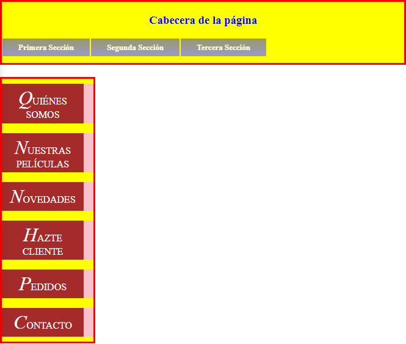

# **LM03 – UT03 – Tarea 04: Maquetación con Flexbox**

El objetivo de esta tarea es aplicar las propiedades fundamentales de **Flexbox** para distribuir varios elementos de una página web sin modificar el HTML original y sin utilizar ninguna propiedad de `position`.
Solo puedes trabajar en el archivo **CSS**.

La estructura HTML se te entregará y **no puede modificarse** bajo ningún concepto.

---

# **Requisitos**

### **R1. No modificar el HTML**

El archivo HTML proporcionado debe mantenerse sin cambios:

* No puedes añadir elementos.
* No puedes eliminar elementos.
* No puedes cambiar clases ni la estructura del documento.
  **Si modificas el HTML, la tarea se considerará incorrecta.**

### **R2. No usar ninguna propiedad de `position`**

Queda prohibido usar `position` en cualquiera de sus variantes:
`absolute`, `relative`, `fixed`, `sticky` o `static`.

### **R3. Header con altura fija**

La cabecera debe tener exactamente **100px de alto**.

### **R4. Estética de la cabecera**

La cabecera debe cumplir:

* Borde **rojo**, **sólido**, **2px**.
* Color de texto **azul**.
* Color de fondo **amarillo**.
* El texto “Cabecera de la página” debe verse **centrado horizontal y verticalmente**.

### **R5. Flexbox obligatorio en la cabecera**

### **R6. Barra superior `.barra1` invertida y alineada al inicio**

Dentro de la cabecera, el elemento con clase `.barra1` debe:

* Mostrar sus elementos **en una sola fila**.
* Estar **alineado al inicio de la cabecera (lado izquierdo)**.
* Mostrar los elementos **en orden inverso al orden HTML**.

### **R7. Menú lateral como contenedor flex en columna**

El menú lateral (dentro de `<aside>`) debe:

* Mostrar sus elementos en **columna**.
* Ajustarse al ancho natural del elemento.

### **R8. Menú lateral invertido**

Los elementos del menú lateral deben aparecer **en orden inverso al orden HTML**.

### **R9. Uso obligatorio de propiedades Flexbox**

Toda la distribución debe hacerse mediante propiedades de Flexbox:
`display`, `flex-direction`, `justify-content`, `align-items`, `order`, etc.

No se aceptan soluciones basadas en márgenes exagerados, flotados o trucos similares.

### **R10. Formato de entrega obligatorio**

La entrega debe consistir exactamente en **tres elementos**:

1. **El archivo HTML original**, sin modificar y manteniendo exactamente el nombre proporcionado.
2. **El archivo CSS**, también sin cambiar el nombre.
3. **Un PDF** que incluya:

   * Una breve explicación de **qué consigue cada *regla CSS relacionad con flexbox*** que has usado.
   * **Capturas de pantalla “antes” y “después”** de aplicar cada regla flexbox.
---

# 📸 Resultado esperado (descripción textual)

---

# 🧭 **Rúbrica de Evaluación (0 – 3 – 6 – 9 – 10)**

| **Calificación** | **Descripción del desempeño**                                                                                                                                                                                       |
| ---------------- | ------------------------------------------------------------------------------------------------------------------------------------------------------------------------------------------------------------------- |
| **0**            | La solución no funciona o no respeta la estructura HTML. No se ha aplicado Flexbox o la página no se visualiza.                                                                                                     |
| **3**            | Se cumple solo una parte mínima. La cabecera o el menú se muestran, pero Flexbox está mal aplicado, o hay incumplimiento de varios requisitos.                                                                      |
| **6**            | La estructura general funciona: la cabecera está construida, el menú aparece en columna, pero hay errores importantes (alineación incorrecta, orden no invertido, falta de centrado, colores erróneos).             |
| **9**            | El trabajo está prácticamente completo: todos los requisitos están implementados salvo uno menor (p. ej. alineación ligeramente incorrecta o un detalle de estilo). No se han modificado el HTML ni usado position. |
| **10**           | La tarea cumple **todos los requisitos R1–R9** con precisión, aplicando Flexbox correctamente, sin modificar el HTML y sin usar `position`. El resultado final coincide completamente con lo solicitado.            |

