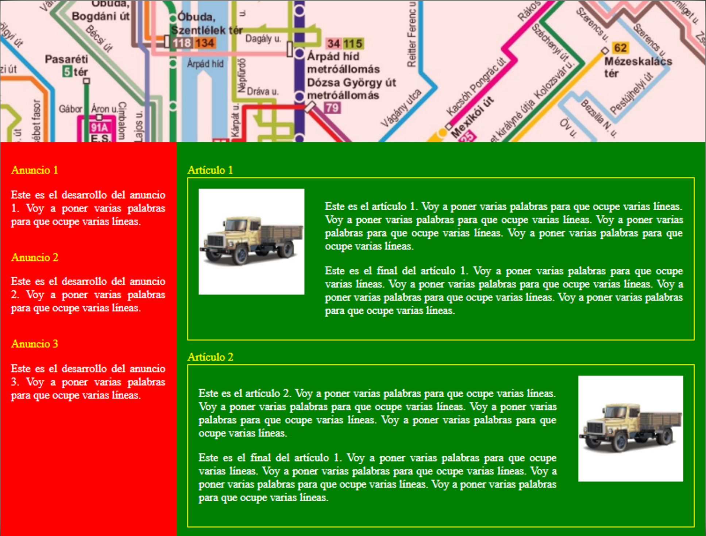

## LM03 – UT03 – **Tarea 05: Maquetación con Grid**

El objetivo de esta tarea es diseñar **desde cero** una página web utilizando **CSS Grid** para obtener un resultado similar al prototipo mostrado en la imagen: cabecera superior, columna de anuncios a la izquierda y zona de artículos a la derecha.

---

## Descripción de la tarea

Debes crear:

* Un archivo `index.html`.
* Un archivo `estilos.css`.

La página debe mostrar:

* Una **cabecera** en la parte superior.
* Una **columna de anuncios** en el lateral izquierdo.
* Una **zona de artículos** en el lateral derecho, con al menos dos artículos.

## Requisitos

**R1. Estructura general**
Organizar la página en tres zonas claras: cabecera, anuncios y contenido principal con artículos.

**R2. Cabecera**
La cabecera debe ocupar todo el ancho y mostrar un mapa.

**R3. Columna de anuncios**
La columna de anuncios debe situarse a la izquierda, con fondo rojo o similar, y contener al menos tres anuncios diferenciados.

**R4. Zona de artículos**
La zona de artículos debe situarse a la derecha, con fondo verde o similar, y mostrar al menos dos artículos, cada uno en un bloque claramente separado.

**R5. Espaciado y márgenes**
Debe existir espacio razonable entre columnas y entre bloques de contenido (márgenes, rellenos, separación entre elementos).

**R6. Restricciones de maquetación**
No está permitido usar `position` (en ninguna variante), `float` ni tablas HTML para maquetar. La solución debe basarse en CSS Grid.

**R7. Formato de entrega**
La entrega debe incluir exactamente:

* `index.html`
* `estilos.css`
* Las imágenes utilizadas
* Un **PDF** con:

  * Breve explicación de las decisiones de diseño (cómo has organizado la rejilla y las zonas).
  * Capturas de pantalla del resultado final.

---

## 🧭 Rúbrica de Evaluación (0 – 3 – 6 – 9 – 10)

| Nota   | Descripción                                                                                                                                                                                                     |
| ------ | --------------------------------------------------------------------------------------------------------------------------------------------------------------------------------------------------------------- |
| **0**  | No se puede visualizar la página, falta alguno de los archivos o no se usa Grid.                                                                                                                                |
| **3**  | La estructura general es confusa; no se distinguen bien cabecera, anuncios y artículos o el uso de Grid es muy limitado/incorrecto.                                                                             |
| **6**  | Se reconocen cabecera, columna de anuncios y zona de artículos, pero hay problemas importantes de tamaño, alineación o estética. El PDF es muy escueto o incompleto.                                            |
| **9**  | La página se parece claramente al prototipo, las tres zonas están bien resueltas con Grid y el diseño es coherente. Solo hay detalles menores mejorables. El PDF explica razonablemente las decisiones tomadas. |
| **10** | Hay un aporte personal extra que se explica y se solicita claramente la nota          |
