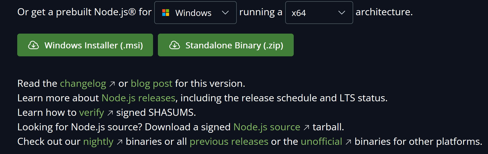

> Guía de instalación: **referencia opcional**, **en esta Unidad de Trabajo no vamos a utilizar Node.js**.
> Nuestro objetivo es comprender JavaScript como lenguaje y aplicarlo directamente en la web, por lo que trabajaremos escribiendo el código en Visual Studio Code y ejecutándolo en el **navegador**, que ya ofrece todas las herramientas necesarias para aprender programación y manipular el DOM sin añadir complejidad adicional.
> Más adelante, en otros módulos o proyectos, sí tendrá sentido introducir Node.js y su ecosistema.

[JS](../indice.md)

# Instalación rápida: Node.js

## 1) Windows

### Instalar Node.js (LTS)

1. Busca **“Download Node.js”** y descarga la **versión LTS** para Windows.
2. Instálalo con las opciones por defecto.
3. **No marques** la opción “Install tools for native modules” (no es necesaria para un curso básico).


**Comprobar:**

```bash
node -v
npm -v
```

Ambos deben mostrar un número de versión.

---

## 2) Linux (Ubuntu)

### A. Instalar Node.js y npm

1. Abre la terminal (`Ctrl + Alt + T`).
2. Escribe los siguientes comandos:

```bash
sudo apt update
sudo apt install -y nodejs npm
```

3. Comprueba la instalación:

```bash
node -v
npm -v
```

---


## 3) Prueba rápida

1. Crea un archivo `hola.js` con el siguiente contenido:

   ```js
   console.log("¡Hola desde Node.js!");
   ```

2. Ejecuta el archivo en la terminal:

   ```bash
   node hola.js
   ```

   Si ves:

   ```
   ¡Hola desde Node.js!
   ```

   🎉 Todo funciona correctamente.

---

## 4) Problemas comunes

| Problema                        | Solución                                                   |
| ------------------------------- | ---------------------------------------------------------- |
| `node` no se reconoce (Windows) | Cierra y vuelve a abrir la terminal, o reinicia el equipo. |
| `code` no se reconoce (Windows) | Reinstala VS Code marcando la opción “Add to PATH”.        |
| Error de permisos en Linux      | Antepone `sudo` al comando que falla.                      |
