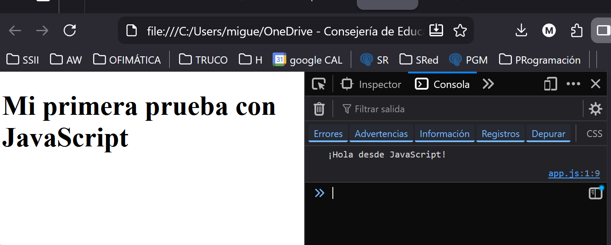

> *(Guía rápida para escribir, ejecutar y observar código usando VSC y Firefox)*
>  
# #️⃣ **Tu primer programa en JavaScript: “Hola Mundo”**

Antes de aprender sintaxis o conceptos más avanzados, vamos a comprobar que tenemos todo lo necesario para **escribir y ejecutar JavaScript en un entorno real**, igual que trabaja cualquier desarrollador web:
➡️ **Visual Studio Code para escribir código**
➡️ **Firefox para ejecutarlo y analizarlo**

---

# **1. Crear los archivos en Visual Studio Code**

Vamos a crear una pequeña página web con un script externo, que será nuestra base de trabajo durante toda la UT.

### ✔️ **1.1 Crea la carpeta de trabajo**

1. Crea en tu equipo una carpeta llamada, por ejemplo, `js-hola-mundo`.
2. Ábrela desde VSC:
   **File → Open Folder… → js-hola-mundo**

### ✔️ **1.2 Crea el archivo HTML**

Dentro de esa carpeta, crea un archivo llamado **`index.html`** con este contenido mínimo:

```html
<!DOCTYPE html>
<html lang="es">
<head>
    <meta charset="UTF-8">
    <title>Hola Mundo JS</title>
</head>
<body>

    <h1>Mi primera prueba con JavaScript</h1>

    <!-- El script se carga al final del body -->
    <script src="app.js"></script>
</body>
</html>
```

### ✔️ ¿Por qué ponemos el script al final del `<body>`?

Porque así **el navegador carga primero el HTML** y después ejecuta JavaScript.
Esto evita errores comunes del tipo “no se encuentra el elemento”.

---

# **2. Escribir nuestro primer script**

Crea en la misma carpeta un archivo llamado **`app.js`** y escribe:

```javascript
console.log("¡Hola desde JavaScript!");
```

Este mensaje aparecerá en la consola del navegador, igual que hacen los programadores para ver qué está pasando dentro del programa.

---

# **3. Ejecutar la página en Firefox**

Tienes dos opciones:

---

## **Opción A: Abrir directamente el archivo HTML**

1. Haz clic derecho sobre `index.html`.
2. Selecciona **"Open with → Firefox"**
   (o simplemente arrastra el archivo dentro de una ventana de Firefox).

Esta forma es suficiente para los primeros ejemplos.

---

## **Opción B: Usar *Live Server***

*(más cómodo cuando modifiques el código muchas veces)*

1. En VSC, instala la extensión **Live Server**.
2. Abre `index.html`.
3. Haz clic en **"Go Live"** (abajo a la derecha).

Firefox abrirá la página en `http://127.0.0.1:5500/` o similar.
Cada vez que guardes los archivos, la página se recargará sola.

---

# **4. Ver la consola del navegador**

Para comprobar que tu programa funciona, vamos a abrir las herramientas para desarrolladores de Firefox.

1. Abre la página en Firefox.
2. Pulsa **F12** o ve a:
   **Menú → Más herramientas → Herramientas del navegador**
3. Selecciona la pestaña **"Consola"**.

### ✔️ ¿Qué deberías ver?

Aparece:

```
¡Hola desde JavaScript!
```

Ese mensaje lo envió tu archivo `app.js` con `console.log()`.

---

# ✨ **Breve explicación de las herramientas del navegador**

Firefox ofrece un conjunto de herramientas muy potentes que usaremos en la UT:

| Herramienta                  | ¿Para qué sirve?                                                            |
| ---------------------------- | --------------------------------------------------------------------------- |
| **Consola**                  | Ver mensajes del programa, errores y valores de variables.                  |
| **Inspector**                | Ver la estructura real del HTML y cómo cambia cuando JS modifica la página. |
| **Depurador (Debugger)**     | Ejecutar el código paso a paso para comprender su comportamiento.           |
| **Red (Network)**            | Ver peticiones, respuestas y tiempos de carga.                              |
| **Almacenamiento (Storage)** | Ver `localStorage`, cookies, etc.                                           |

Al principio solo usaremos **Consola** e **Inspector**, pero esta base será muy útil el futuro.