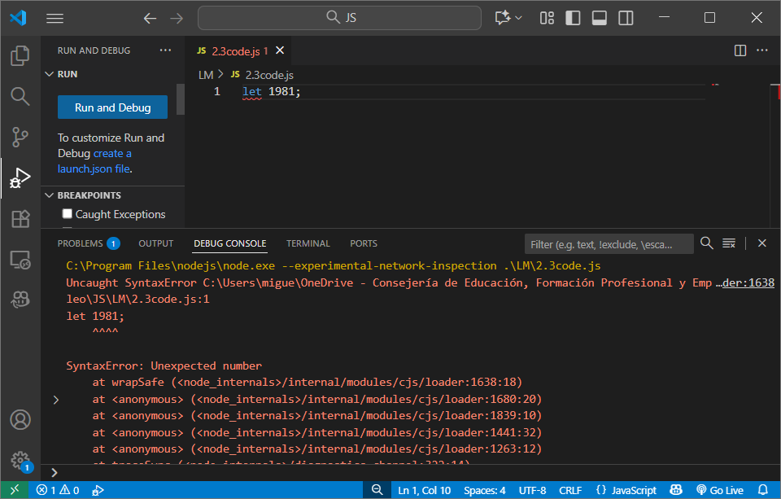
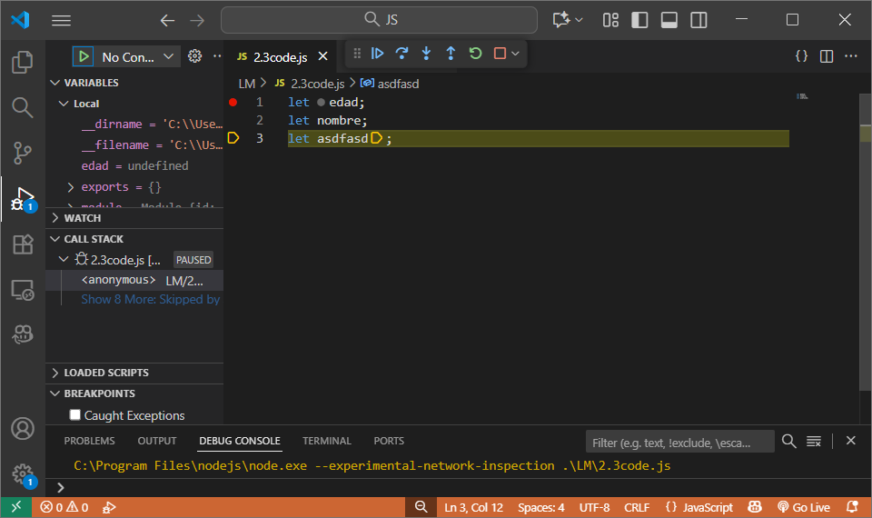
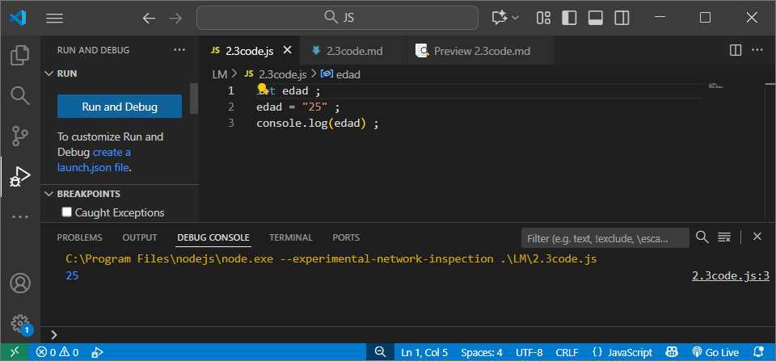
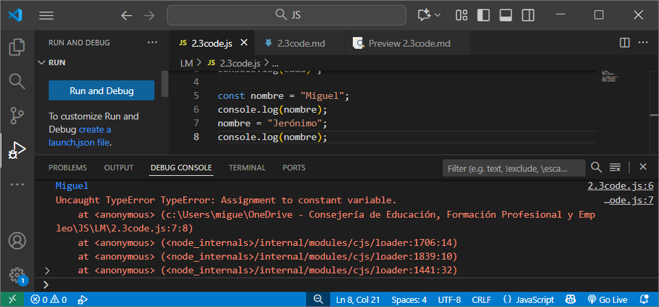

[JS](../indice.md)

> Cómo el intérprete nos muestra los errores, importante: nos indica el  número de línea.

> Cómo el debugger nos ayuda
> 
> Le damos valor y lo vemos con console
> 
> No se puede modificar una constante
> 