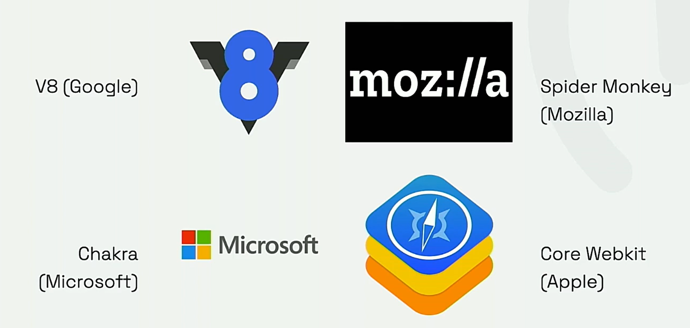

- [Dónde se usa JavaScript](#dónde-se-usa-javascript)
  - [Motores JS](#motores-js)
    - [🔹 Principales motores](#-principales-motores)
- [JavaScript hoy se usa en **muchos ámbitos**, no solo en páginas web.](#javascript-hoy-se-usa-en-muchos-ámbitos-no-solo-en-páginas-web)
    - [🌐 **1. Web (Front-End y Back-End)**](#-1-web-front-end-y-back-end)
    - [💻 **2. Escritorio**](#-2-escritorio)
    - [📱 **3. Móviles**](#-3-móviles)
    - [🧩 **4. Transpilación**](#-4-transpilación)
    - [🎮 **5. Videojuegos**](#-5-videojuegos)

# Dónde se usa JavaScript
## Motores JS

Un **motor de JavaScript** es el **programa que interpreta y ejecuta el código JS** dentro de un navegador o en el servidor.

Su función es:

1. **Leer** el código fuente (parsing).
2. **Convertirlo** a un formato que la máquina entienda (bytecode o código máquina).
3. **Optimizarlo y ejecutarlo** rápidamente.

---

### 🔹 Principales motores

* **V8** → de **Google**, usado en **Chrome** y en **Node.js**.
* **SpiderMonkey** → de **Mozilla**, usado en **Firefox**.
* **JavaScriptCore (Nitro)** → de **Apple**, usado en **Safari**.
* **Chakra** → de **Microsoft**, usado antiguamente en **Edge clásico**.

---

📌 Todos hacen lo mismo (interpretar y optimizar JavaScript),
pero **V8** es el más influyente hoy, porque permite ejecutar JS **fuera del navegador**, gracias a **Node.js**.

# JavaScript hoy se usa en **muchos ámbitos**, no solo en páginas web.

---

### 🌐 **1. Web (Front-End y Back-End)**

* **Front-End:** se ejecuta en el **navegador** para crear páginas **interactivas y dinámicas** (botones, menús, animaciones…).
  👉 Frameworks comunes: **React**, **Vue**, **Angular**.
* **Back-End:** con **Node.js**, puede ejecutarse en el **servidor** (manejar bases de datos, APIs, etc.).

---

### 💻 **2. Escritorio**

* Gracias a **Electron**, se pueden crear aplicaciones **de escritorio multiplataforma** (Windows, Linux, macOS).
  👉 Ejemplos: **Visual Studio Code**, **Slack**, **Discord**.

---

### 📱 **3. Móviles**

* Con **React Native**, **Ionic** o **NativeScript**, se pueden desarrollar **apps móviles** para Android e iOS usando JavaScript (o TypeScript).

---

### 🧩 **4. Transpilación**

* JavaScript puede **generarse a partir de otros lenguajes** como **TypeScript**, **CoffeeScript** o **Dart**, que luego se “**transpilan**” a JS para ejecutarse en cualquier navegador.
  👉 Esto mejora la organización y la seguridad del código.

---

### 🎮 **5. Videojuegos**

* Se usa en motores como **Phaser**, **Babylon.js** o **Three.js** para crear **videojuegos 2D y 3D** que funcionan directamente en el navegador.

---

📌 En resumen:
JavaScript ha pasado de ser un lenguaje para dar vida a las páginas web a convertirse en un **lenguaje universal** capaz de crear aplicaciones **web, de servidor, móviles, de escritorio y juegos**.
