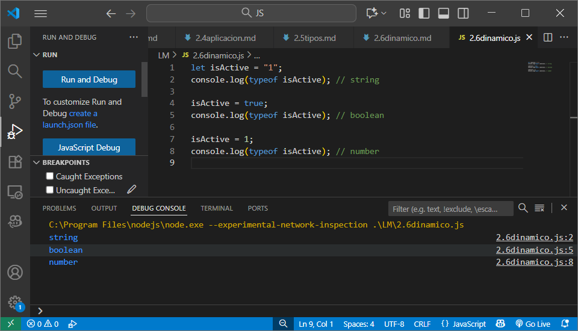

[JS](../indice.md)

## Tipado dinámico
```js
let isActive = "1";
console.log(typeof isActive); // string

isActive = true;
console.log(typeof isActive); // boolean

isActive = 1;
console.log(typeof isActive); // number
```

**Tipado dinámico:**
En JavaScript, el tipo de una variable se determina **en tiempo de ejecución**, no al declararla.
Una misma variable puede cambiar de tipo según el valor que se le asigne.
Por eso `isActive` pasa de ser una **cadena** a un **booleano** y luego a un **número** sin generar error.


## Conversión controlada (Casting)

El **casting** o **conversión de tipo** consiste en **transformar un valor de un tipo a otro** de forma explícita, usando funciones constructoras de los tipos básicos.

```js
let currentYear = "2023";

// A número
currentYear = Number(currentYear);   // 2023 → number

// A booleano
currentYear = Boolean(currentYear);  // true → boolean

// A cadena
currentYear = String(currentYear);   // "true" → string

// A null
currentYear = null;                  // null → object (por diseño histórico)

// A undefined
currentYear = undefined;             // undefined → undefined

console.log(typeof currentYear);
```

En JavaScript, las funciones `Number()`, `Boolean()` y `String()` permiten hacer **casting explícito**.
También pueden ocurrir **conversiones implícitas** (automáticas) cuando el lenguaje intenta adaptar tipos en operaciones, pero en este ejemplo el cambio de tipo es **controlado por el programador**.
