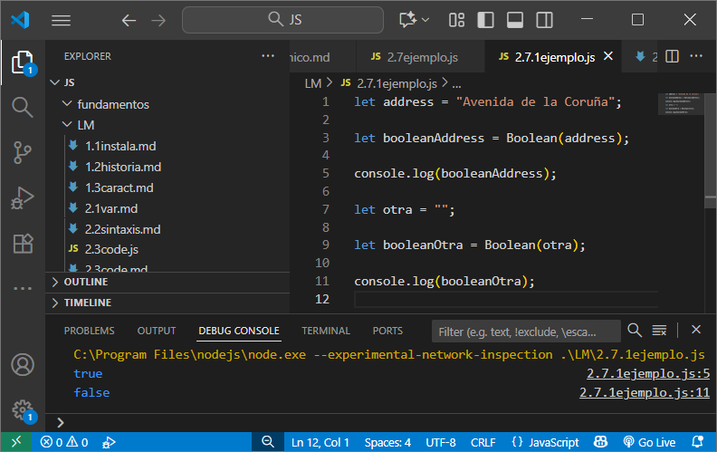
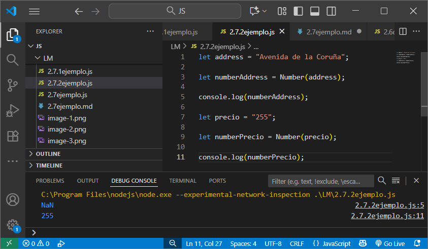
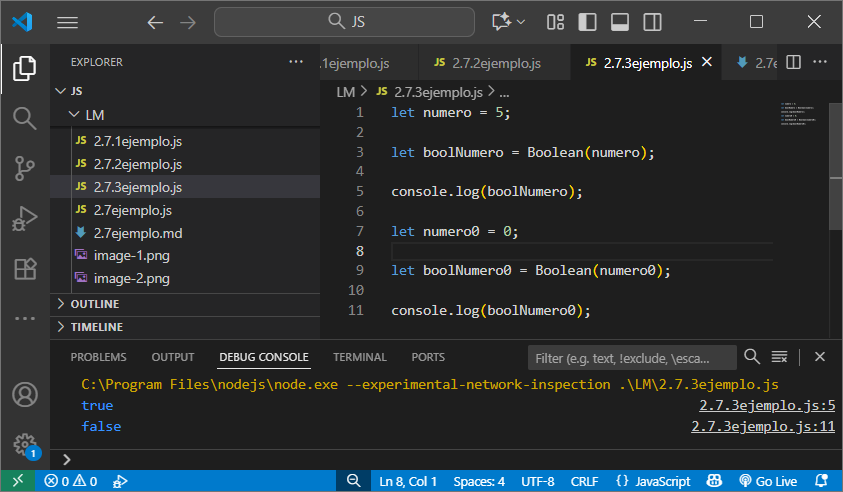

> 2.7 muestra los tipos de variables por consola
> 
> 2.7.1 al castear un String a boolean, si está vacío es null
> 
> 2.7.2 al castera de String a number, si hay caracteres no numéricos, obtenemos NaN
> 
> 2.7.3 al castear de número a Boolean, si es 0 o null vale falso, si es distinto de 0 vale true
> 