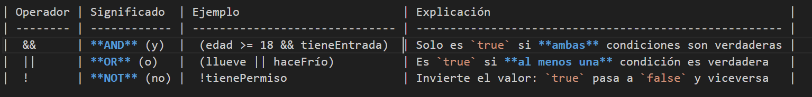

[JS](../indice.md)

### **Operadores de comparación en JavaScript**

Los operadores de comparación permiten **evaluar relaciones entre valores** y devuelven siempre un resultado booleano: `true` o `false`. Son la base de cualquier decisión en un programa.

| Operador | Significado                                      | Ejemplo     | Resultado |
| -------- | ------------------------------------------------ | ----------- | --------- |
| `==`     | Igualdad (comparación *suave*)                   | `5 == "5"`  | `true`    |
| `===`    | Igualdad estricta (mismo valor **y** mismo tipo) | `5 === "5"` | `false`   |
| `!=`     | Distinto (comparación suave)                     | `5 != "5"`  | `false`   |
| `!==`    | Distinto estricto (distinto valor o tipo)        | `5 !== "5"` | `true`    |
| `>`      | Mayor que                                        | `8 > 3`     | `true`    |
| `<`      | Menor que                                        | `2 < 4`     | `true`    |
| `>=`     | Mayor o igual                                    | `5 >= 5`    | `true`    |
| `<=`     | Menor o igual                                    | `3 <= 2`    | `false`   |

**Recomendación para el aula**: utiliza siempre las versiones **estrictas** (`===` y `!==`) para evitar comparaciones automáticas que pueden generar errores difíciles de detectar.

---

### **Operadores lógicos en JavaScript**

Los operadores lógicos permiten **combinar condiciones**. Son esenciales para expresar decisiones complejas dentro de un `if`, igual que en la vida cotidiana combinamos factores antes de actuar.

        

---

### Ejemplos combinados

```javascript
let edad = 20;
let carnet = true;

if (edad >= 18 && carnet) {
    console.log("Puedes conducir");
}

let llueve = false;
let paraguas = true;

if (!llueve || paraguas) {
    console.log("Puedes salir tranquilo");
}
```


