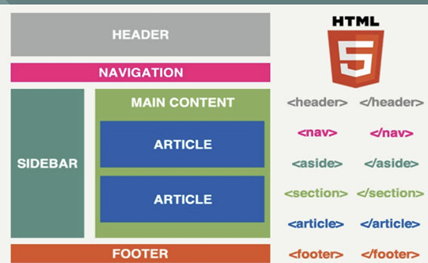

Muestra de la función semántica/estructural de algunas etiquetas HTML5.

Aquí tienes una lista de las etiquetas HTML5 que sirven para agrupar elementos, junto con una breve descripción de su propósito:

1. **`<header>`**: Representa la cabecera de una sección o de la página completa. Suele contener el logo, título, menú de navegación, etc.

2. **`<footer>`**: Define el pie de una sección o de la página. Incluye información de contacto, derechos de autor, enlaces a políticas, etc.

3. **`<nav>`**: Indica un bloque de enlaces de navegación. Generalmente usado para menús de navegación principales o secundarios.

4. **`<section>`**: Define una sección temática del documento. Es una agrupación de contenido relacionado, como un capítulo, tema, o sección de la página.

5. **`<article>`**: Representa un contenido independiente y autónomo que podría ser distribuido por separado, como un artículo de un blog, un comentario, o una noticia.

6. **`<aside>`**: Contenido relacionado indirectamente con el contenido principal, como barras laterales, cuadros de información adicional, o anuncios.

7. **`<main>`**: Denota el contenido principal del documento. Solo debe haber un `<main>` por página y debe contener el contenido central, excluyendo los encabezados, barras laterales, pie de página, etc.

8. **`
`**: Un contenedor genérico sin un significado semántico específico. Se utiliza principalmente para aplicar estilos o agrupar elementos por razones de estructura o comportamiento.

9. **`<figure>`**: Agrupa contenido ilustrativo, como imágenes, gráficos, tablas, y su correspondiente leyenda, que normalmente se asocia con el contenido circundante.

10. **`<figcaption>`**: Proporciona una leyenda o título a un elemento `<figure>`.

11. **`
`**: Crea un widget de divulgación, que permite al usuario mostrar u ocultar información adicional.

12. **`
`**: Define un encabezado visible para el contenido `
`. Al hacer clic en el `
`, el contenido del `
` se expande o se oculta.

13. **`<fieldset>`**: Agrupa elementos de un formulario, junto con su `<legend>`, para representar un conjunto relacionado de campos.

14. **`<legend>`**: Proporciona un título o descripción para el contenido de un `<fieldset>`.

15. **`<mark>`**: Destaca o resalta texto, como si estuviera marcado con un resaltador.

16. **`<address>`**: Define información de contacto del autor o del propietario de un documento.

Estas etiquetas son esenciales para estructurar el contenido de manera semántica en HTML5, lo que mejora tanto la accesibilidad como el SEO del documento.