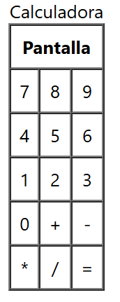

**Pregunta de examen práctico: HTML - Calculadora básica sin CSS**

**Instrucciones:** 

Crea la interfaz de una calculadora básica utilizando exclusivamente HTML, sin incluir estilos CSS. Utiliza los elementos que hemos aprendido durante la unidad de trabajo para distribuir los botones y simular la interfaz de una calculadora.

**Requisitos:**

1. **Estructura general:**
   - Deberás crear una calculadora que contenga una "pantalla" en la parte superior y un total de **15 botones**.
   - La pantalla será representada con un elemento adecuado que muestre un mensaje de "resultado" cuando se pulse cualquier botón.

2. **Distribución:**
   - Los botones se deben distribuir en una **cuadrícula de 3 columnas y 5 filas**.
   - La pantalla estará ubicada encima de la cuadrícula de botones.

3. **Botones a incluir:**
   - **Números del 0 al 9**: Deberán estar dispuestos de forma coherente.
   - **Operaciones básicas**: Deben incluir **suma (+)**, **resta (-)**, **multiplicación (\*)**, **división (/)** y **igual (=)**.

4. **Interactividad simulada:**
   - Cuando se pulse cualquier botón, el contenido de la "pantalla" debe cambiar y mostrar la palabra **"resultado"**.

**Pautas:**

- Organiza el contenido de manera clara y limpia para que la interfaz sea fácilmente entendible.
- **No se requiere funcionalidad JavaScript**. Solo se necesita simular la interfaz y el comportamiento básico de la pantalla.
  
**Ejemplo de estructura visual:**

